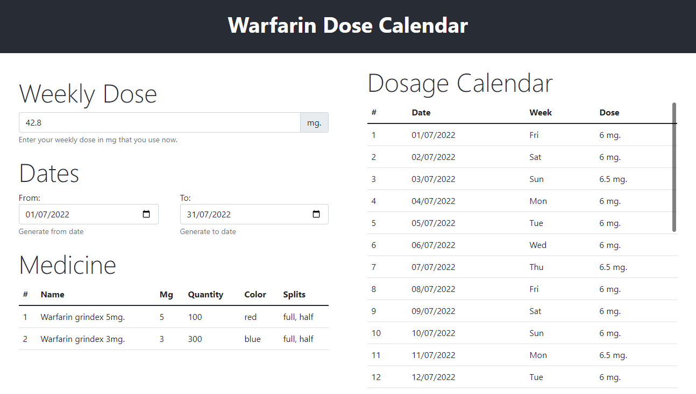

# About

This project was aimed at people who need to take anticoagulants (blood thinners) throughout their lives and monitor their INR levels.

[DEMO](https://stonkus.lt/projects/warfarin-dose-calendar/)

The main idea is that you know your weekly dose, for example 42.2mg/week. You enter this value, you choose how many days you would like to generate, set your medicines. Its all, calculator will calculate optimal schedule for you.

Additional example: you must have INR for 2.5 (just in case), but your blood test show INR3.2. Then you calculate by this formula (3.2-2.5)*10=7%, then 42.2mg-7% = your new weekly dose 39,25mg/week. Set this to calculator and use your new ideal dose schedule.

Later I hope will do this automatically in the new version of this app.

## Install

1. clone project
2. npm i
3. npm start
